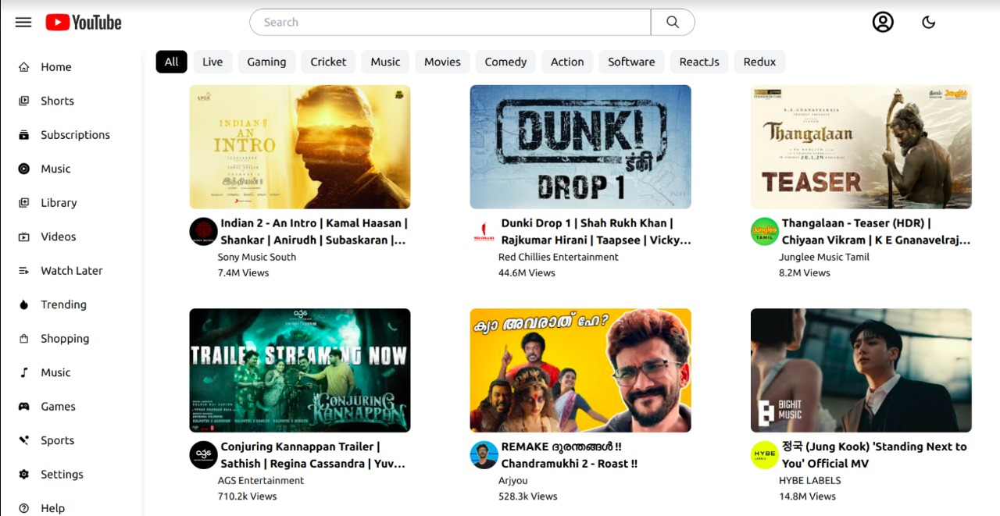
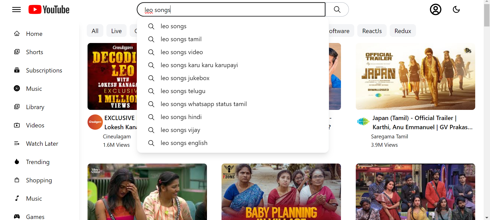
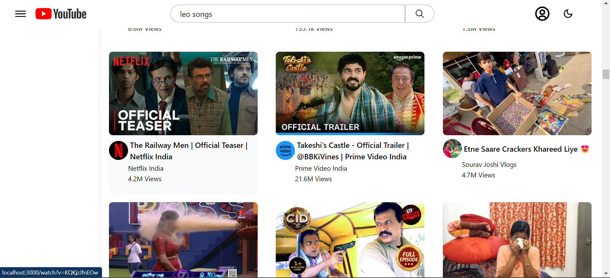
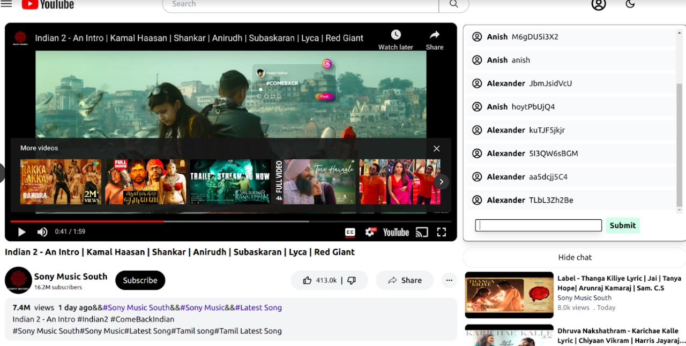
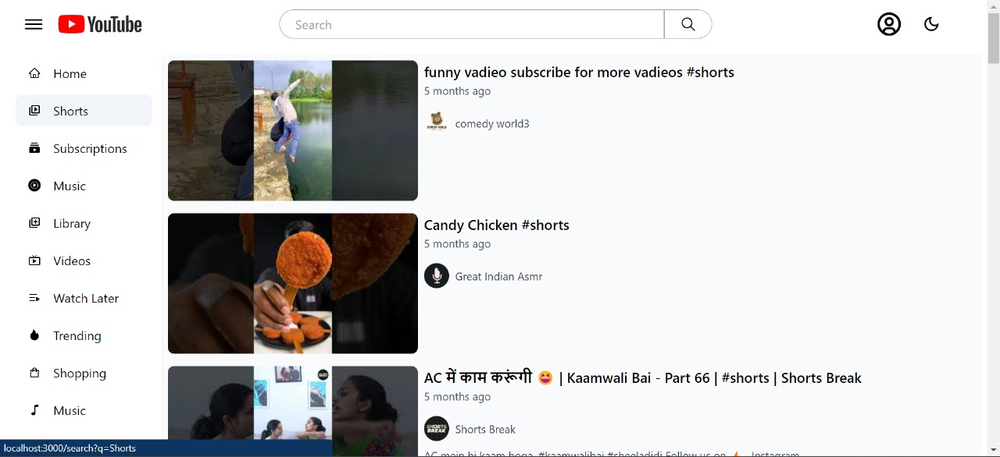

### Technologies And Main Libray used YouTube Replica

- React: Used as the primary front-end library.
- Redux Toolkit: For state management.
- React Router: For routing within the application.
- Parcel: The bundler used for the project.
- Babel: As the transcompiler for modern JavaScript.

## Functionality of the App

### Home Page

### Home Page in Dark Mode

### Search Suggestions While Entering Data in the Search Bar

### Enabling Infinite Scroll While Scrolled Down

### Streaming Video && Show chatBox

### Clicking on Shorts in Side Bar

